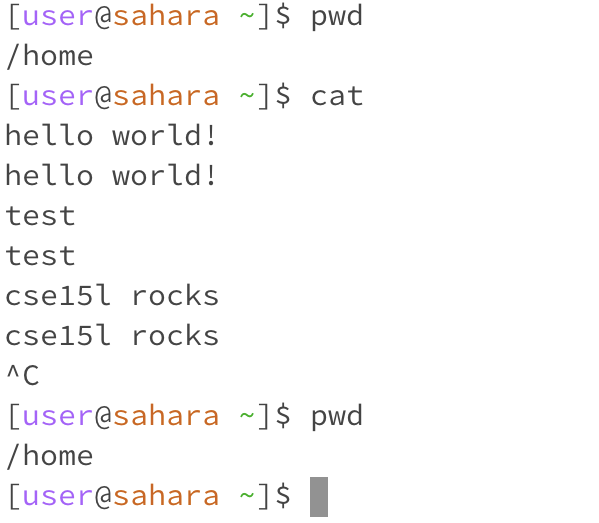

*Lab Report 1*

*Monday, 9 October 2023*

---

## Task

For each of the commands cd, ls, and cat, and using the workspace you created in this lab, share an example of:
1. Using the command with no arguments.
2. Using the command with a path to a directory as an argument.
3. Using the command with a path to a file as an argument.

For each, include:
1. A screenshot or Markdown code block showing the command and its output.
2. What the working directory was when the command was run.
3. A sentence or two explaining why you got that output (e.g. what was in the filesystem, what it meant to have no arguments).
4. Indicate whether the output is an error or not, and if it’s an error, explain why it’s an error.

---

## cd
*Change Directory: used to switch the current working directory to the given path*

> cd

Working directory when the command was run: /home

Output explanation: Using the command 'cd' with no argument does not change anything. The initial working directory, as displayed by the command 'pwd,' does not get switched; it remains the same before and after running 'cd' with no arguments.

The output is not an error. The 'cd' command produces no output when it works. In this case, it was not an error and no changes were made.

> cd lecture1

Working directory when the command was run: /home

Output explanation: Running the command 'cd lecture1' switched the current working directory, /home, to /home/lecture1, which can be seen after running 'pwd' the second time.

The output is not an error. After running 'cd lecture1,' no output was produced which means it worked. Further, the working directory printed after running the command was /home/lecture1, which is consistent with the expected results.

> cd Hello.java

Working directory when the command was run: /home/lecture1

Output explanation: The initial working directory before running 'cd Hello.java' was /home/lecture1. After running 'cd Hello.java' the current working directory displayed by 'pwd' remains the same. Since Hello.java is a file and not a directory, the command was unable to switch the current working directory.

The output is an error because the 'cd' command is used to switch the current working directory to the given path. It cannot switch the current working directory to a file.

## ls
*List: used to list the files and folders in the given path*

> ls

Working directory when the command was run: /home

Output explanation: The 'ls' command with no arguments simply lists the files and folders in the current working directory since no specific path was given as an argument. In this case, the current working directory was /home therefore 'ls' printed out the folder lecture1 and the java file lab1.java, which can be seen in the image below are the only two files and folders in the /home working directory.

The output is not an error.

> ls lecture1

Working directory when the command was run: /home

Output explanation: The command 'ls lecture1' lists the files and folders in the /home/lecture1 path. As shown in the image below, there are four files and folders under lecture1, namely 'Hello.class', 'Hello.java', 'messages', and 'README', which are consistent with the output shown in the first image above.

Another thing to note is that the argument given to the command in 'ls lecture1' is not an absolute path. 'lecture1' is simply a relative path. The terminal automatically adds the relative path to the end of the current working directory to combine it and produce an absolute path. In this case, the absolute path becomes '/home/lecture1'.

The output is not an error.

> ls Hello.java

Working directory when the command was run:

Output explanation:

Error/not...

## cat
*Concatenate: used to print the contents of one or more files given by the paths*

> cat

Working directory when the command was run:

Output explanation:

Error/not...

> cat <directory>

Working directory when the command was run:

Output explanation:

Error/not...

> cat <file>

Working directory when the command was run:

Output explanation:

Error/not...
