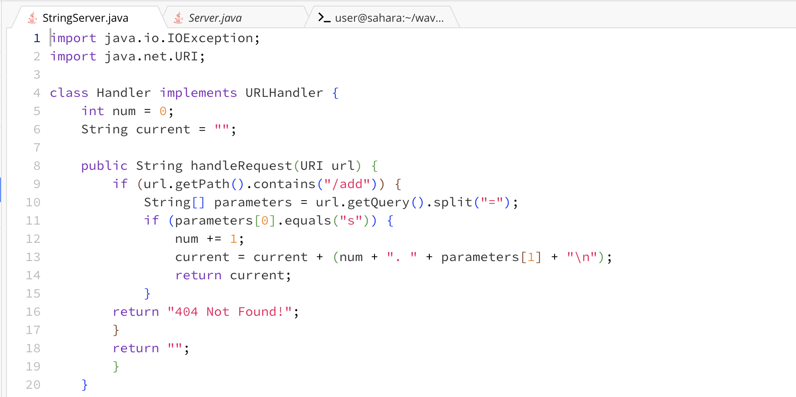
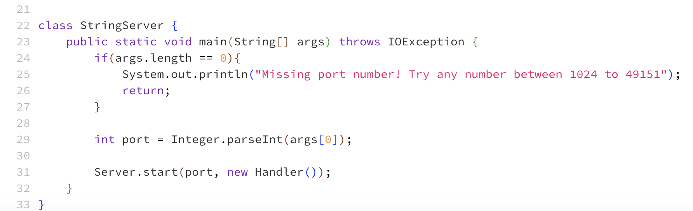
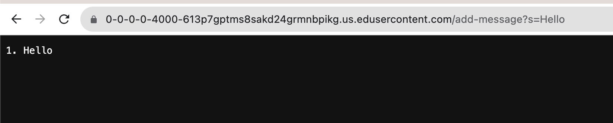
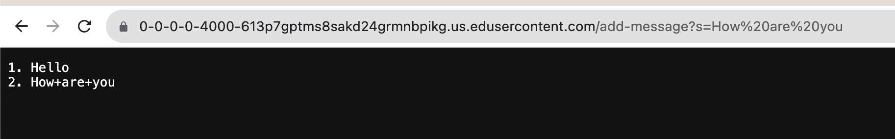
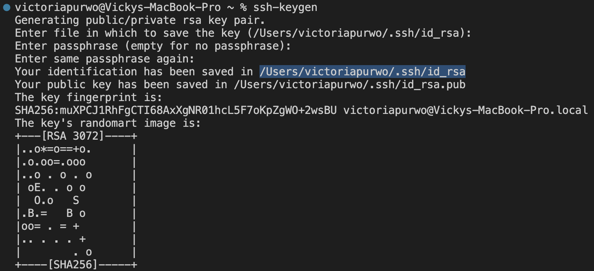
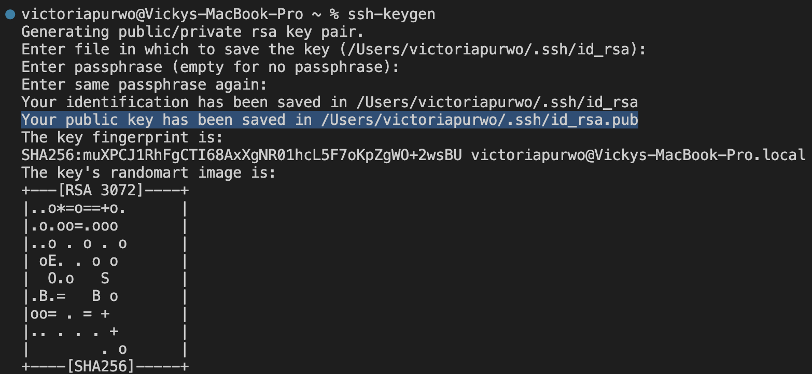
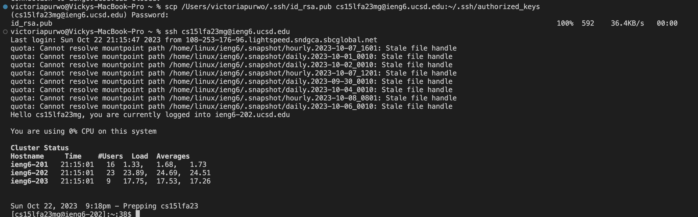

*Lab Report 2 - Servers and SSH Keys*

*Sunday, 22 October 2023*

---

## Part 1

Write a web server called StringServer that supports the path and behavior described below. It should keep track of a single string that gets added to by incoming requests. Show the code for your StringServer, and two screenshots of using /add-message.

> Code for my StringServer

> Using /add-message for the first time

- Which methods in your code are called?

The handleRequest method is called.
  
- What are the relevant arguments to those methods, and the values of any relevant fields of the class?

The handleRequest method takes in one parameter which is the URL. The argument in this case is the URL, which is "https://0-0-0-0-4000-5h3u8651abehci7t8ndrqtqo5o.us.edusercontent.com/add-message?s=Hello".

As for the relevant fields of the class, here are their values:
1. int num = 0
2. String current = ""
3. String[] parameters = "s=Hello"
  
- How do the values of any relevant fields of the class change from this specific request? If no values got changed, explain why.
By values, we mean specific String s, int s, URI s, and so on. "abc" is a value, 456 is a value, new URI("http://...") is a value, and so on.)

1. num goes from 0 to 1
2. current goes from "" to "1. Hello"

> Using /add-message for the second time

- Which methods in your code are called?

The handleRequest method is called.
  
- What are the relevant arguments to those methods, and the values of any relevant fields of the class?

The handleRequest method takes in one parameter which is the URL. The argument in this case is the URL, which is "https://0-0-0-0-4000-5h3u8651abehci7t8ndrqtqo5o.us.edusercontent.com/add-message?s=How%20are%20you".

As for the relevant fields of the class, here are their values:
1. int num = 1
2. String current = "1. Hello" + "\n"
3. String[] parameters = "s=How%20are%20you"
  
- How do the values of any relevant fields of the class change from this specific request? If no values got changed, explain why.

1. num goes from 1 to 2
2. current goes from "1. Hello" to "1. Hello" + "\n" + "2. How are you" + "\n"

---

## Part 2

Using the command line, show with ls and take screenshots of:

1. The path to the private key for your SSH key for logging into ieng6 (on your computer or on the home directory of the lab computer)

2. The path to the public key for your SSH key for logging into ieng6 (within your account on ieng6)

3. A terminal interaction where you log into ieng6 with your course-specific account without being asked for a password.

---

## Part 3

In a couple of sentences, describe something you learned from lab in week 2 or 3 that you didn’t know before.

I thought that in order to remotely connect to a server, I would have to enter my password every single time I login. It was honestly such a hassle for me to enter my password every time, especially because the command line does not show the password I enter. So I was happy to find out that it is possible to set up SSH keys for easy access and not have to enter my password each time. Another thing I learned was how to make a very simple "search engine" in lab 2, which I struggled with at first but eventually got my code running after multiple tries. 
