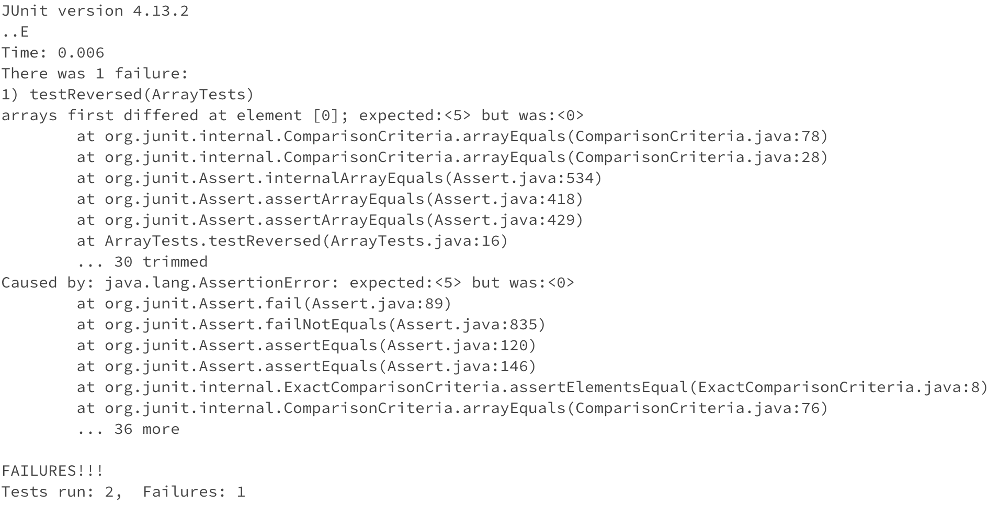
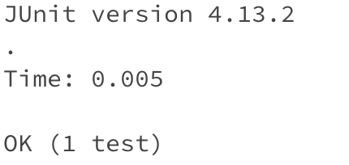

*Lab Report 3 - Bugs and Commands*

*Sunday, 5 November 2023*

---

## Part 1 - Bugs

- Choose one of the bugs from week 4’s lab:

The bug in the ```reversed``` array method.

- A failure-inducing input for the buggy program, as a JUnit test and any associated code:

```
@Test
public void testReversed() {
  int[] input = {1, 2, 3, 4, 5};
  assertArrayEquals(new int[]{5, 4, 3, 2, 1}, ArrayExamples.reversed(input));
}
```

- An input that doesn’t induce a failure, as a JUnit test and any associated code:

```
@Test
public void testReversed() {
  int[] input = {0};
  assertArrayEquals(new int[]{0}, ArrayExamples.reversed(input));
}
```

- The symptom, as the output of running the tests (provide it as a screenshot of running JUnit with at least the two inputs above):

> The output when the test failed (the symptom)



> The output when the test was a success



- The bug, as the before-and-after code change required to fix it:

> Before: the buggy code
```
static int[] reversed(int[] arr) {
    int[] newArray = new int[arr.length];
    for(int i = 0; i < arr.length; i += 1) {
      arr[i] = newArray[arr.length - i - 1];
    }
    return arr;
}
```

> After: the fixed code
```
static int[] reversed(int[] arr) {
    int[] newArray = new int[arr.length];
    for(int i = 0; i < arr.length; i += 1) {
      newArray[i] = arr[arr.length - i - 1];
    }
    return newArray;
}
```

- Briefly describe why the fix addresses the issue:

The ```reversed``` method should return a new array with all the elements of the input array in reversed order. The problem with the initial code is that it is copying elements from ```newArray``` into the input ```arr``` in reversed order, then returning the input ```arr``` and not a new array. Moreover, the elements copied from ```newArray``` into ```arr``` are all ```0```. When we initialize the ```newArray``` in ```int[] newArray = new int[arr.length];```, the initial values will be 0 for each element in the array since in Java, integer arrays are initialized to 0 by default. This is why the input in #4 which was an array with a single element 0 (```int[] input = {0};```) did not induce a failure.

The change I made to fix the code made sure that it copies the elements from the input ```arr``` into the new array ```newArray``` (instead of the other way around) and then returns ```newArray``` instead of ```arr```.

---

## Part 2 - Researching Commands

The ```find``` command

```-size```

> This option specifies the size of the file you want to find. You can filter your results to smaller than or greater than a specific size. You can use several different suffixes: 'b' for 512-byte blocks, 'c' for bytes, 'w' for two-byte words, 'k' for kibibytes, 'M' for mebibites, 'G' for gibibytes.

*[Source](https://man7.org/linux/man-pages/man1/find.1.html)*

- This command finds all files that are greater than 10MB. There are no files that are greater than 10MB in the technical directory, as seen in the output below. This option can be useful in many scenarios, such as searching for large files as a way to declutter and/or save storage space.

```
$ find /home/docsearch/technical -size +10M

```

- This command finds all files that are smaller than 100MB, which can be useful when you want to narrow down the results to only small files and when you know you are not looking for large files.

```
$ find /home/docsearch/technical/911report -size -100M
/home/docsearch/technical/911report
/home/docsearch/technical/911report/chapter-13.1.txt
/home/docsearch/technical/911report/chapter-6.txt
/home/docsearch/technical/911report/chapter-13.2.txt
/home/docsearch/technical/911report/chapter-5.txt
/home/docsearch/technical/911report/chapter-1.txt
/home/docsearch/technical/911report/chapter-13.3.txt
/home/docsearch/technical/911report/chapter-12.txt
/home/docsearch/technical/911report/chapter-11.txt
/home/docsearch/technical/911report/chapter-13.5.txt
/home/docsearch/technical/911report/chapter-13.4.txt
/home/docsearch/technical/911report/chapter-8.txt
/home/docsearch/technical/911report/chapter-10.txt
/home/docsearch/technical/911report/chapter-7.txt
/home/docsearch/technical/911report/chapter-2.txt
/home/docsearch/technical/911report/preface.txt
/home/docsearch/technical/911report/chapter-9.txt
/home/docsearch/technical/911report/chapter-3.txt
```

```-iname```

> This option is like -name, but the match is case insensitive. For example, the pattern `Fo*` matches the file names `Foo`, `foo`, `FO0`, `FOO`, `fOO`, etc.

*[Source](https://www.redhat.com/sysadmin/linux-find-command)*

- This command finds all files that match ```*CHAPTER*```, which means the name includes the letters 'CHAPTER', case insensitive. As seen below, the file paths listed below contain the lowercase letters 'chapter' but are still listed in the results. This can be useful when you cannot remember the exact name of the file you are looking for, and/or if you are unsure about the capitalization of the name.
 
```
$ find /home/docsearch/technical/911report -iname *CHAPTER*
/home/docsearch/technical/911report/chapter-13.1.txt
/home/docsearch/technical/911report/chapter-6.txt
/home/docsearch/technical/911report/chapter-13.2.txt
/home/docsearch/technical/911report/chapter-5.txt
/home/docsearch/technical/911report/chapter-1.txt
/home/docsearch/technical/911report/chapter-13.3.txt
/home/docsearch/technical/911report/chapter-12.txt
/home/docsearch/technical/911report/chapter-11.txt
/home/docsearch/technical/911report/chapter-13.5.txt
/home/docsearch/technical/911report/chapter-13.4.txt
/home/docsearch/technical/911report/chapter-8.txt
/home/docsearch/technical/911report/chapter-10.txt
/home/docsearch/technical/911report/chapter-7.txt
/home/docsearch/technical/911report/chapter-2.txt
/home/docsearch/technical/911report/chapter-9.txt
/home/docsearch/technical/911report/chapter-3.txt
```

- This command finds all files in /home/docsearch/technical/911report that matches ```*chAPTer-1```, which in this case include 5 .txt files. Again, this option can be useful for the same reasons mentioned above in #1.
 
```
$ find /home/docsearch/technical/911report -iname *chAPTer-13
/home/docsearch/technical/911report/chapter-13.1.txt
/home/docsearch/technical/911report/chapter-13.2.txt
/home/docsearch/technical/911report/chapter-13.3.txt
/home/docsearch/technical/911report/chapter-13.5.txt
/home/docsearch/technical/911report/chapter-13.4.txt
```

```-maxdepth```

> This option limits the depth of searches by the number of directories you want to go into after the starting point.

*[Source](https://www.redhat.com/sysadmin/linux-find-command)*

- This command will only find files that are only 1 directory deep, which in the case below are only the technical, biomed, and 911report directories. This is useful because with hundreds or even thousands of files in a user directory and beyond that, you may often get overwhelming results way beyond what you are looking for. So this option is useful to limit the depth of searches.
 
```
$ find /home/docsearch/technical -maxdepth 1
/home/docsearch/technical
/home/docsearch/technical/biomed
/home/docsearch/technical/911report
```

- This command will only find files that are 2 directories deep. In the example below, I added the option ```-name *1471-2180-2*``` to further narrow down and limit the search because without that filter the results would be too long. Again, this option can be useful for the same reason stated above in #1. In the case below, the results that are only 2 directories deep and match the pattern are some of the .txt files in the biomed directory.
 
```
$ find /home/docsearch/technical -maxdepth 2 -name *1471-2180-2*
/home/docsearch/technical/biomed/1471-2180-2-16.txt
/home/docsearch/technical/biomed/1471-2180-2-1.txt
/home/docsearch/technical/biomed/1471-2180-2-2.txt
/home/docsearch/technical/biomed/1471-2180-2-13.txt
/home/docsearch/technical/biomed/1471-2180-2-7.txt
/home/docsearch/technical/biomed/1471-2180-2-32.txt
/home/docsearch/technical/biomed/1471-2180-2-22.txt
/home/docsearch/technical/biomed/1471-2180-2-38.txt
/home/docsearch/technical/biomed/1471-2180-2-35.txt
/home/docsearch/technical/biomed/1471-2180-2-26.txt
/home/docsearch/technical/biomed/1471-2180-2-20.txt
/home/docsearch/technical/biomed/1471-2180-2-29.txt
```

```-type```

> This option specifies the type of file you want to find.

*[Source](https://www.redhat.com/sysadmin/linux-find-command)*

- ```-type f``` specifies that you want to look for regular files (all the file paths; the actual files and not the ones that are just directories). Regular files include common types of files, such as text files and script files. This can be useful when you just want to look for file paths and don't want to include all the directory names. In the command below I narrowed down the directory to find the files to only the 911report directory because the biomed directory has a very long list of files. However, if the command was ```$ find /home/docsearch/technical -type f``` instead, all the .txt files in 911report and biomed would be listed, and the technical, 911report, and biomed directories would not be listed. In the output below, all the files in 911report are .txt files so they are all listed.
 
```
$ find /home/docsearch/technical/911report -type f
/home/docsearch/technical/911report/chapter-13.1.txt
/home/docsearch/technical/911report/chapter-6.txt
/home/docsearch/technical/911report/chapter-13.2.txt
/home/docsearch/technical/911report/chapter-5.txt
/home/docsearch/technical/911report/chapter-1.txt
/home/docsearch/technical/911report/chapter-13.3.txt
/home/docsearch/technical/911report/chapter-12.txt
/home/docsearch/technical/911report/chapter-11.txt
/home/docsearch/technical/911report/chapter-13.5.txt
/home/docsearch/technical/911report/chapter-13.4.txt
/home/docsearch/technical/911report/chapter-8.txt
/home/docsearch/technical/911report/chapter-10.txt
/home/docsearch/technical/911report/chapter-7.txt
/home/docsearch/technical/911report/chapter-2.txt
/home/docsearch/technical/911report/preface.txt
/home/docsearch/technical/911report/chapter-9.txt
/home/docsearch/technical/911report/chapter-3.txt
```

- ```-type d``` specifies that you want to look for directories only. This is useful when you only want to look for directories and not every single file path. The ```ls``` command does not allow you to filter results by file type, so the results can be overwhelming if you only want a list of directories and not all the file paths. The output below shows the technical, biomed, and 911report directories, as expected.
 
```
$ find /home/docsearch/technical -type d
/home/docsearch/technical
/home/docsearch/technical/biomed
/home/docsearch/technical/911report
```
