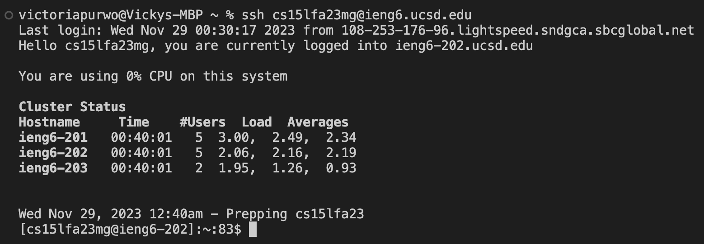
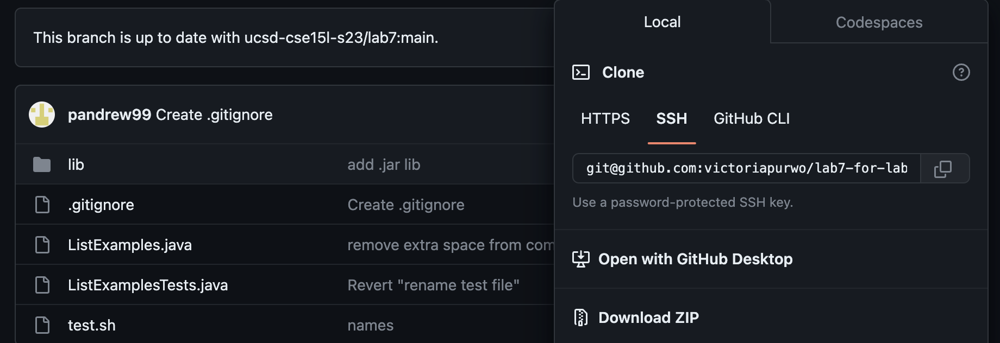
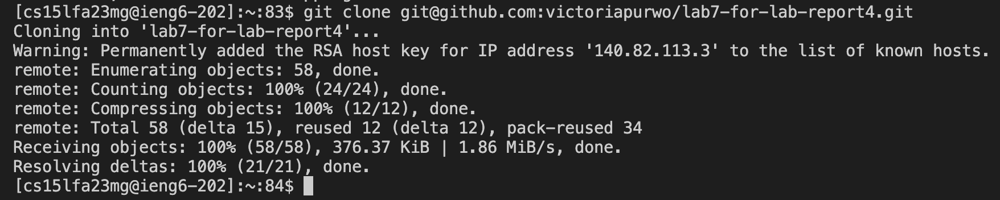
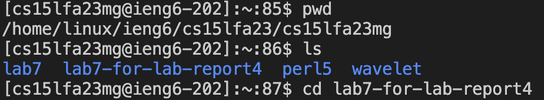
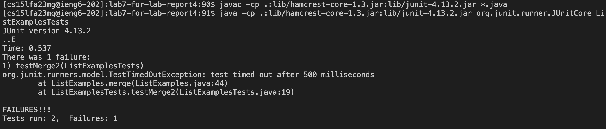

*Lab Report 4 - Vim*

*Tuesday, 28 November 2023*

---

For the lab report this week, reproduce the task below. For each numbered step starting right after the timer (so steps 4-9), take a screenshot, and write down exactly which keys you pressed to get to that step. For special characters like ```<enter>``` or ```<tab>```, write them in angle brackets with code formatting. Then, summarize the commands you ran and what the effect of those keypresses were.

1. Setup: Delete any existing forks of the repository you have on your account
2. Setup: Fork the repository
3. The real deal: Start the timer!
4. Log into ieng6
5. Clone your fork of the repository from your Github account (using the ```SSH``` URL)
6. Run the tests, demonstrating that they fail
7. Edit the code file to fix the failing test
8. Run the tests, demonstrating that they now succeed
9. Commit and push the resulting change to your Github account (you can pick any commit message!)

---

## Step 4
### Log into ieng6



Keys pressed:
```ssh cs15lfa23mg@ieng6.ucsd.edu```
```<enter>```

I am already set up to SSH without a password using keys, so I was immediately logged into my account and remotely connected to ieng-202 without having to type my password, as shown in the image above.

---

## Step 5
### Clone your fork of the repository from your Github account using the ```SSH``` URL

I copied the ```SSH``` URL from here:




Keys pressed:
```git clone ```
```<command> V```

Since I've already copied the ```SSH``` clone URL from GitHub on my browser, I simply pasted the ```SSH``` clone URL using ```<command> V``` after typing ```git clone ```.

---

## Step 6
### Run the tests, demonstrating that they fail

First I had to ```cd``` into the correct working directory first before being able to run the tests




Keys pressed:
```pwd```
```<enter>```
```ls```
```<enter>```
```cd lab7-for-lab-report4```
```<enter>```
```<up><up><up><up><up><up><enter```
```<up><up><up><up><up><up><enter```

I used the ```pwd``` command to check what my current directory was.

```ls``` was just another command to double check and make sure I was about to ```cd``` into the correct and desired directory.

Then I used ```cd``` to change the working directory to ```lab7-for-lab-report4```. which is what I renamed the forked repository to in step 2.

The javac -cp .:lib/hamcrest-core-1.3.jar:lib/junit-4.13.2.jar *.java command was 4 up in the search history, so I used up arrow to access it. Then the java -cp .:lib/hamcrest-core-1.3.jar:lib/junit-4.13.2.jar org.junit.runner.JUnitCore ... command was 4 up in the history, so I accessed and ran it in the same way.

The ```javac -cp .:lib/hamcrest-core-1.3.jar:lib/junit-4.13.2.jar *.java``` command was 6 up in my search history so I simply used the ```<up>``` arrow to access it without retyping the whole line. Then the ```java -cp .:lib/hamcrest-core-1.3.jar:lib/junit-4.13.2.jar org.junit.runner.JUnitCore ListExamplesTests``` command was also 6 up in my search history at this point, so I accessed and ran it the same way. These commands are in my search history because prior to starting this lab report I wanted to make sure that my set up was correct and I had everything working (able to make change to my repository by editing, adding, and pushing all with the command line).

---

## Step 7
### Edit the code file to fix the failing test
