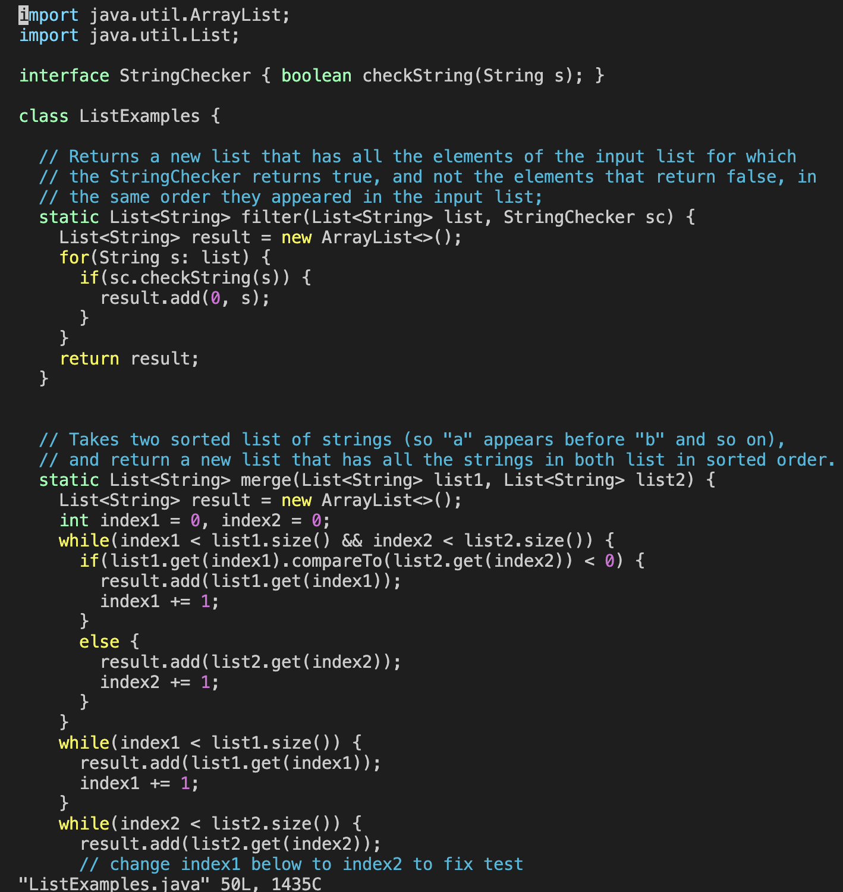
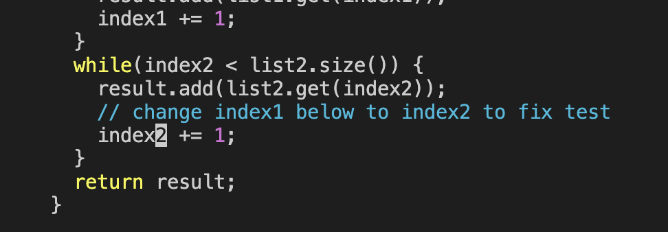
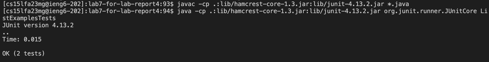
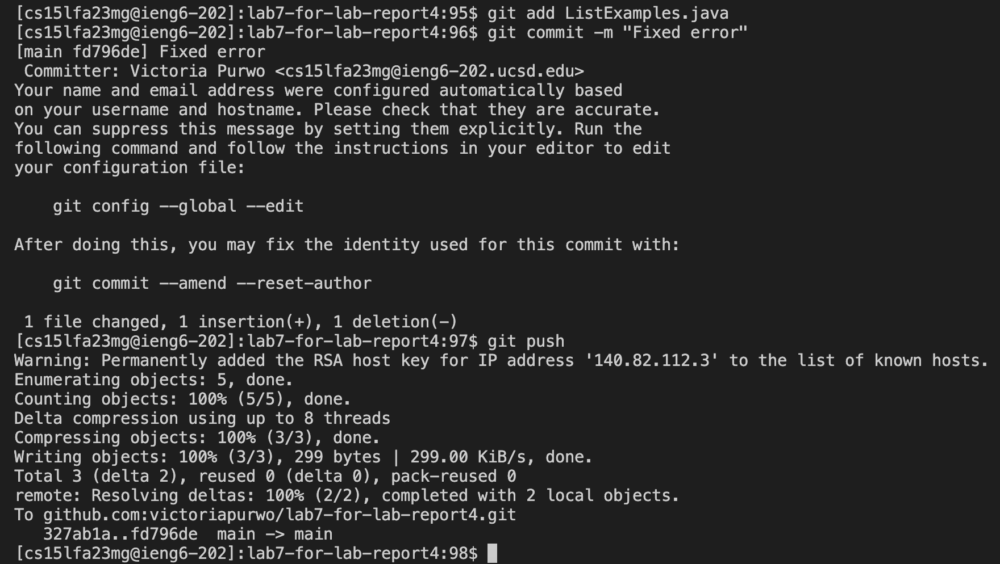
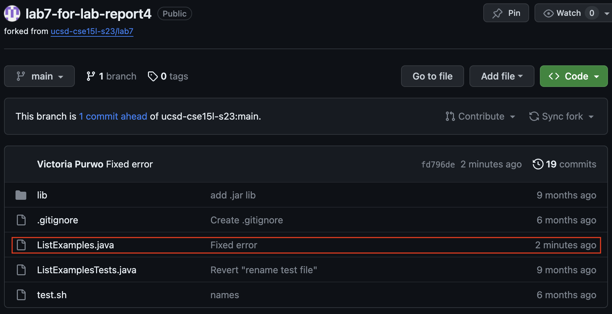
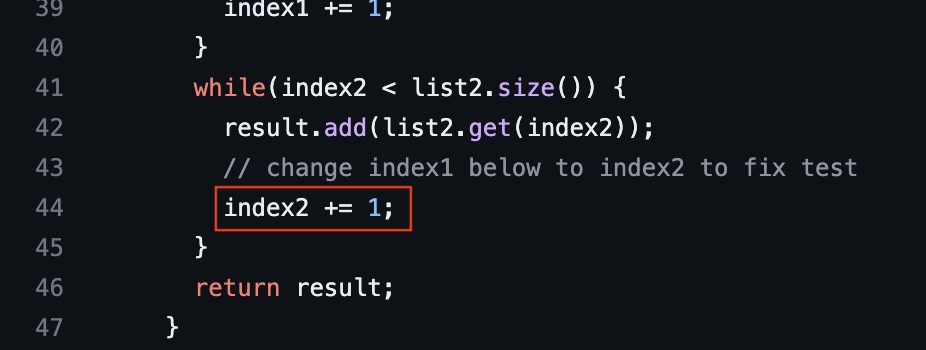

*Lab Report 4 - Vim*

*Tuesday, 28 November 2023*

---

For the lab report this week, reproduce the task below. For each numbered step starting right after the timer (so steps 4-9), take a screenshot, and write down exactly which keys you pressed to get to that step. For special characters like ```<enter>``` or ```<tab>```, write them in angle brackets with code formatting. Then, summarize the commands you ran and what the effect of those keypresses were.

1. Setup: Delete any existing forks of the repository you have on your account
2. Setup: Fork the repository
3. The real deal: Start the timer!
4. Log into ieng6
5. Clone your fork of the repository from your GitHub account using the ```SSH``` URL
6. Run the tests, demonstrating that they fail
7. Edit the code file to fix the failing test
8. Run the tests, demonstrating that they now succeed
9. Commit and push the resulting change to your GitHub account

---

## Step 4
### Log into ieng6


Keys pressed:
```ssh cs15lfa23mg@ieng6.ucsd.edu```
```<enter>```

I am already set up to SSH without a password using keys, so I was immediately logged into my account and remotely connected to ieng-202 without having to type my password, as shown in the image above.

---

## Step 5
### Clone your fork of the repository from your GitHub account using the ```SSH``` URL

I copied the ```SSH``` URL from here:


Keys pressed:
```git clone ```
```<command>V```

Since I've already copied the ```SSH``` clone URL from GitHub on my browser, I simply pasted the ```SSH``` clone URL using ```<command>V``` after typing ```git clone ```. Then it successfully cloned my fork of the repository from my GitHub account, as evident in the output/messages shown.

---

## Step 6
### Run the tests, demonstrating that they fail

First I had to ```cd``` into the correct working directory before being able to compile and run the tests


Keys pressed:
```pwd```
```<enter>```
```ls```
```<enter>```
```cd lab7-for-lab-report4```
```<enter>```
```<up><up><up><up><up><up><enter>```
```<up><up><up><up><up><up><enter>```

I used the ```pwd``` command to check what my current directory was. ```ls``` was just another command to double check and make sure I was about to ```cd``` into the correct and desired directory. Then I used ```cd``` to change the working directory to ```lab7-for-lab-report4```, which is what I renamed the forked repository to in step 2.

The ```javac -cp .:lib/hamcrest-core-1.3.jar:lib/junit-4.13.2.jar *.java``` command was 6 up in my search history so I simply used the ```<up>``` arrow to access it without retyping the whole line. Then the ```java -cp .:lib/hamcrest-core-1.3.jar:lib/junit-4.13.2.jar org.junit.runner.JUnitCore ListExamplesTests``` command was also 6 up in my search history at this point, so I accessed and ran it the same way. These commands are in my search history because prior to starting this lab report I wanted to make sure that my setup was correct and I had everything working (able to make change to my repository by editing, adding, and pushing all with the command line).

As shown in the image above, there was 1 failure in the tests.

---

## Step 7
### Edit the code file to fix the failing test

Opening ListExamples.java in Vim:




Pressing ```43j``` ```11l``` brought my cursor to the exact spot I wanted to make the edit, as shown below:


Saving my changes and quitting Vim:


Keys pressed:
```vim ListExamples.java```
```<enter>```
```43j```
```11l```
```x```
```i```
```2```
```<esc>```
```:wq```
```<enter>```

To edit the code file to fix the failing test using the command line, I opened ListExamples.java in Vim by typing ```vim ListExamples.java``` ```<enter>```.
When the file opened in Vim, the position of my cursor was initially on the first line and first column, so I typed ```43j``` ```11l```.
```j``` is equivalent to the down arrow, ```l``` is equivalent to the right arrow.
```43j``` means down 43 times and ```11l``` means right 11 times. I did 43 and 11 times respectively because the exact location of the error I wanted to fix was on line 44, column 12, so I needed to go down 43 times and go to the right 11 times to land on that exact spot.
Then I pressed ```x``` to delete the single character that the cursor was on (the ```1``` in ```index1``` of the final loop in the ```merge``` method).
Then I pressed ```i``` to go into INSERT mode (as I was previously in NORMAL mode). Without moving the cursor, I simply pressed ```2``` so that what was previously ```index1``` in the final loop in the ```merge``` method is now corrected to ```index2```.
Then I pressed ```<esc>``` to exit INSERT mode, and typed ```:wq``` ```<enter>``` to save my changes and quit Vim.

---

## Step 8
### Run the tests, demonstrating that they now succeed



Keys pressed:
```<up><up><up><enter>```
```<up><up><up><enter>```

The ```javac -cp .:lib/hamcrest-core-1.3.jar:lib/junit-4.13.2.jar *.java``` command was 3 up in my search history so I simply used the ```<up>``` arrow to access it without retyping the whole line. Then the ```java -cp .:lib/hamcrest-core-1.3.jar:lib/junit-4.13.2.jar org.junit.runner.JUnitCore ListExamplesTests``` command was also 3 up in my search history at this point, so I accessed and ran it the same way. (I used these exact commands in step 6, which is why they are relatively recent in my search history).

As shown in the image above, both tests passed after the errors were fixed in the previous step.

---

## Step 9
### Commit and push the resulting change to your GitHub account



Keys pressed:
```git add ListExamples.java```
```<enter>```
```git commit -m "Fixed error"```
```<enter>```
```git push```
```<enter>```

First I staged ```ListExamples.java``` to be part of the next commit using ```git add ListExamples.java``` ```<enter>```.
Then I created a commit locally for the staged file  ```ListExamples.java``` with a commit message using ```git commit -m "Fixed error"``` ```<enter>```.
Finally, I typed ```git push``` ```<enter>```, and the changes I made were successfully pushed to my GitHub account.

Screenshots to show the successful commit and push:


