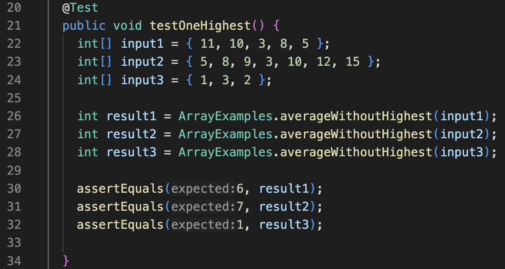

*Lab Report 5 - Putting it All Together*

*Friday, 1 December 2023*

---

## Part 1 – Debugging Scenario

Design a debugging scenario, and write your report as a conversation on EdStem. It should have:

1. The original post from a student with a screenshot showing a symptom and a description of a guess at the bug/some sense of what the failure-inducing input is.
2. A response from a TA asking a leading question or suggesting a command to try.
3. Another screenshot/terminal output showing what information the student got from trying that, and a clear description of what the bug is.
4. At the end, all the information needed about the setup including:
- The file & directory structure needed
- The contents of each file before fixing the bug
- The full command line (or lines) you ran to trigger the bug
- A description of what to edit to fix the bug

You should actually set up and run the scenario from your screenshots. It should involve at least a Java file and a bash script. Describing the bug should involve reading some output at the terminal resulting from running one or more commands. Design an error that produces more interesting output than a single message about a syntax or unbound identifier error – showcase some interesting wrong behavior! Feel free to set this up by cloning and breaking some existing code like the grading script or code from class, or by designing something of your own from scratch, etc.

---

> **CSE Student's Original Post:**

Hi! I'm working on PA9, more specifically the ```averageWithoutHighest()``` method but I keep encountering weird issues.
The write-up states that the ```averageWithoutHighest()``` method should return an integer of the average of the numbers in the array but leave out the highest number in the calculation. And if there are two of the same highest numbers, then it should leave both of them out when calculating (there will not be more than two highest elements). If there are no elements in the array, or if there is only 1 element, then it should return 0.

The actual output matches my expected output only when there are fewer than two elements in the input array, in which the output is simply ```0```. However, when the input array is of a larger size, the tests fail. For example, ```{ 11, 10, 3, 8, 5 }``` is a failure-inducing input that produces the output ```5``` instead of the expected ```6```.

Here is my code right now:


These tests I ran that use an input array with fewer than two elements passed:


These tests I ran that use an input array with two or more elements failed:


I also wrote tests for cases where there are two of the same highest elements in the input array, but they also failed:


Here is an instance of when the test failed (symptom). The input array was ```{ 11, 10, 3, 8, 5 }```, and the output (symptom) was ```5``` instead of the expected ```6```:


After running the tests and looking at the failing output from JUnit, I realized that all the actual outputs were smaller than the expected output. This leads me to believe that either the variable ```sum``` is always calculated to be smaller than it should be, or that the variable ```count``` is calculated to be larger than it should be. I have tried making changes to my code, but it still has not worked properly. In fact, some changes that I tried has broken the code even more, so I think that this current code I have has been the closest I can get it to working properly. Can I please get some guidance on how to fix my code? Thanks in advance!

---

> **TA's Response:**

Hello! In these types of situations it is extremely helpful to break down your code into parts and use print statements (```System.out.println()```) in certain parts to see and keep track of the values of your variables. By doing so you can see how the values of your variables change throughout the code, and narrow down the spot where something went wrong. Which variables in your code have values that change? Which variables do you think are crucial for the output of your code?

---

> **Student:**

So I added print statements for ```sum``` and ```count``` in the second for loop to keep track of how the value of each of these variables are changed (incremented) during each loop:


Then I ran it with the input array ```{ 11, 10, 3, 8, 5 }```, and these are the values printed out:


By doing this, I saw that the final value of ```sum``` is ```26``` so it is being added correctly, as it leaves out the highest element which is ```11```. However, to get the correct average without the highest element, ```sum``` should actually be divided by ```4``` since we are leaving out ```11```. But the final print statement for ```count``` shows that its value is ```5```, which is wrong.

I ran the same steps above again but with a different input array, one where there are two of the same highest elements. The ```sum``` variable also appears to be correct, leaving out both of the highest elements in its calculation. However, the ```count``` variable simply counts the number of elements in the entire array without leaving the highest elements out.

Now I know the bug is that the variable ```count``` includes all the elements in the array including the highest number(s), which leads to a wrong output. This also explains why all the previous tests I ran produced actual outputs that were smaller than the expected outputs! The bug is the wrong placement of ```count += 1;```. By placing it outside the if statement that checks if the current number is the highest numbers, ```count``` is incremented for each element that the for loop iterates over, which is the entire array. It does not only get incremented when the element being checked is not the highest number in the array, so it overcounts and does not leave the highest number(s) out of the calculation.

Thanks for the help!

---

Step 4

Here is all the information needed about the setup:

> **The files & directory structure needed**

```
lab-report-9
  - lib
    - hamcrest-core-1.3.jar
    - junit-4.13.2.jar
  - ArrayExamples.java
  - ArrayTests.java
  - test.sh
```


> **The contents of each file before fixing the bug**

### ArrayExamples.java


### ArrayTests.java


### test.sh


> **The full command line (or lines) you ran to trigger the bug**

```bash test.sh```

Since I already have the commands I need to compile the java files and run the JUnit tests in the bash script ```test.sh```, I simply needed to type ```bash test.sh``` to compile and run. The failure-inducing inputs to trigger the bug are in ```ArrayTests.java```, as explained in the "CSE Student's Original Post" section of the report.

> **A description of what to edit to fix the bug**

I fixed the code by placing ```count += 1;``` inside the if statement that checks if the current number is the highest numbers. This ensures that ```count``` is only incremented if the current number is not the highest number, thus excluding the highest number(s) into ```count``` which will calculate the average properly.

Here is the fixed code:


Now all the tests pass:


---

## Part 2 – Reflection

*In a couple of sentences, describe something you learned from your lab experience in the second half of this quarter that you didn’t know before. It could be a technical topic we addressed specifically, something cool you found out on your own building on labs, something you learned from a tutor or classmate, and so on.*

---

My lab experience in the second half of this quarter has been insightful and fun; I've learned quite a lot!

The most interesting one was getting to understand how grading scripts and autograders are built and how they work, and even getting to try to build one on my own. Every time I submit a programming assignment in other CSE classes, I've always wondered how the autograders on Gradescope worked. Getting my grading script/autograder to run properly was definitely a struggle at first, but after some help from my lab friends and tutors, we finally got it working at the end.

Another thing I learned that I believe is going to be the most useful and practical is how to do everything from the command line: committing and pushing to GitHub, editing files on Vim and all the cool tricks and shortcuts that come with it. I actually enjoyed Lab 7 where I timed myself doing command line tasks and constantly tried to beat my own record by learning and getting used to the different shortcuts.
